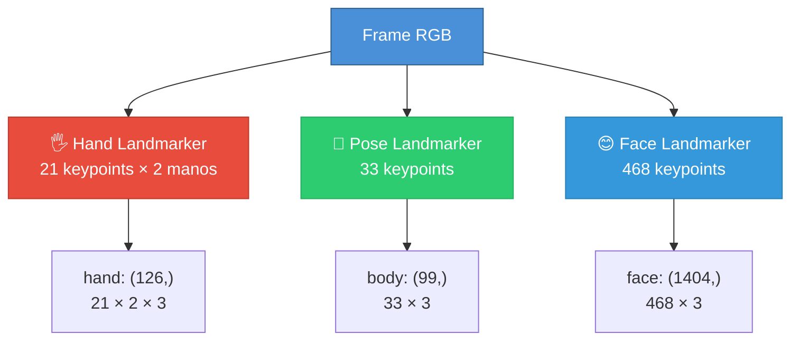
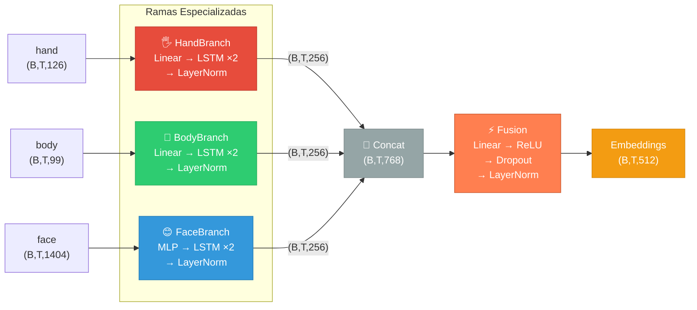
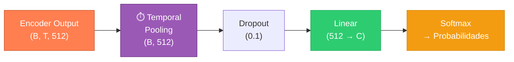

# 🧠 Arquitectura del Modelo — ComSigns

> **Dominio:** Reconocimiento de Lengua de Señas · **Framework:** PyTorch · **Parámetros:** ~4.7M

---

## 📖 Navegación

| Documento | Descripción |
|-----------|-------------|
| [📘 Documentación Técnica](MODEL_TECHNICAL.md) | Formato de entradas/salidas, inferencia, limitaciones |
| [🏋️ Entrenamiento](TRAINING.md) | Trainer, checkpointing, métricas, augmentation |
| [👤 Guía de Usuario](USER_GUIDE.md) | Instalación, ejecución de scripts, troubleshooting |
| [🏗️ Arquitectura General](../comsigns/docs/ARCHITECTURE.md) | Visión general del sistema (pipeline + dataset + resultados) |
| [⚙️ Servicios](../services/SERVICES_TECH_DOC.md) | Documentación técnica de `services/` |

---

## 1. Pipeline Completo

El modelo convierte video de lengua de señas en predicciones de glosas (palabras) mediante un pipeline de tres etapas:


### Shapes a lo largo del pipeline

| Etapa | Entrada | Salida |
|-------|---------|--------|
| **MediaPipe** | Frame RGB `(H, W, 3)` | Keypoints: hand `(126,)` · body `(99,)` · face `(1404,)` |
| **Encoder** | `(B, T, 126)` · `(B, T, 99)` · `(B, T, 1404)` | Embeddings `(B, T, 512)` |
| **Pooling** | `(B, T, 512)` | Vector fijo `(B, 512)` |
| **Clasificador** | `(B, 512)` | Logits `(B, num_classes)` |

> [!NOTE]
> `B` = batch size, `T` = longitud temporal (variable entre muestras), `126` = 2 manos × 21 keypoints × 3 coords (x, y, z).

---

## 2. Extracción de Keypoints (MediaPipe)

El preprocesador utiliza [MediaPipe Tasks](https://developers.google.com/mediapipe/solutions/vision) para extraer puntos de interés de cada frame.



| Componente | Modelo MediaPipe | Keypoints | Dimensión aplanada |
|------------|------------------|-----------|--------------------|
| **Manos** | `hand_landmarker.task` | 21 × 2 manos | **126** (21 × 3 × 2) |
| **Cuerpo** | `pose_landmarker_lite.task` | 33 puntos | **99** (33 × 3) |
| **Rostro** | `face_landmarker.task` | 468 puntos | **1404** (468 × 3) |

Cada keypoint contiene 3 valores: `[x, y, z]` normalizados.

> **Código fuente:** [preprocessing/](../comsigns/services/preprocessing/) · **Setup:** [MODELS_SETUP.md](../comsigns/MODELS_SETUP.md)

---

## 3. Encoder Multimodal

El corazón del modelo. Tres ramas especializadas procesan cada modalidad en paralelo y se fusionan en un embedding unificado.

### 3.1 Visión general del Encoder



### 3.2 Ramas Hand y Body

Ambas comparten la misma estructura, solo difiere la dimensión de entrada:

```
Input → Linear(input_dim → 256) → LSTM(256, 256, layers=2, dropout=0.1) → LayerNorm(256)
```

```python
class HandBranch(nn.Module):
    input_proj: Linear(126 → 256)
    lstm: LSTM(256, 256, num_layers=2, batch_first=True, dropout=0.1)
    layer_norm: LayerNorm(256)
```

### 3.3 Rama Face

Utiliza un MLP para reducir la alta dimensionalidad facial antes del LSTM:

```
Input → Linear(1404 → 512) → ReLU → Dropout → Linear(512 → 256) → LSTM → LayerNorm
```

```python
class FaceBranch(nn.Module):
    input_proj: Sequential(
        Linear(1404 → 512), ReLU, Dropout(0.1),
        Linear(512 → 256)
    )
    lstm: LSTM(256, 256, num_layers=2, batch_first=True, dropout=0.1)
    layer_norm: LayerNorm(256)
```

### 3.4 Capa de Fusión

Combina las 3 ramas y proyecta a la dimensión de salida:

```python
fusion: Sequential(
    Linear(768 → 512),   # 256 × 3 ramas concatenadas
    ReLU(),
    Dropout(0.1),
    LayerNorm(512)
)
```

### 3.5 Hiperparámetros del Encoder

| Parámetro | Valor | Descripción |
|-----------|-------|-------------|
| `hidden_dim` | 256 | Dimensión interna de cada rama |
| `output_dim` | 512 | Dimensión del embedding final |
| `num_layers` | 2 | Capas de LSTM por rama |
| `dropout` | 0.1 | Regularización |
| **Total parámetros** | **~4.7M** | Encoder completo |

> **Código fuente:** [encoder/model.py](../comsigns/services/encoder/model.py) · **README:** [encoder/README.md](../comsigns/services/encoder/README.md)

---

## 4. Clasificador

El clasificador convierte los embeddings temporales en predicciones de clase.



### Temporal Pooling

Convierte secuencias de longitud variable a un vector de tamaño fijo:

| Estrategia | Descripción | Uso |
|------------|-------------|-----|
| `mean` | Promedio sobre timesteps | **Default** — robusto |
| `max` | Máximo sobre timesteps | Captura picos |
| `last` | Último timestep válido | Para secuencias ordenadas |

### SignLanguageClassifier

```python
class SignLanguageClassifier(nn.Module):
    def __init__(self, encoder, num_classes, pooling="mean", dropout=0.1):
        self.encoder = MultimodalEncoder()
        self.dropout = Dropout(0.1)
        self.classifier = Linear(512, num_classes)

    def forward(self, hand, body, face, lengths=None):
        embeddings = self.encoder(hand, body, face)    # (B, T, 512)
        pooled = temporal_pool(embeddings, lengths)     # (B, 512)
        logits = self.classifier(self.dropout(pooled))  # (B, C)
        return logits
```

> **Código fuente:** [training/classifier.py](../comsigns/training/classifier.py)

---

## 5. Dimensiones de Referencia Rápida

```
┌─────────────────────────────────────────────────────────────────────────┐
│                     SHAPES CHEAT SHEET                                  │
├──────────────────┬──────────────────────────────────────────────────────┤
│ hand_keypoints   │ (B, T, 126)  → 2 manos × 21 keypoints × 3 coords  │
│ body_keypoints   │ (B, T, 99)   → 33 keypoints × 3 coords            │
│ face_keypoints   │ (B, T, 1404) → 468 keypoints × 3 coords           │
├──────────────────┼──────────────────────────────────────────────────────┤
│ hand_embedding   │ (B, T, 256)  → Salida HandBranch                   │
│ body_embedding   │ (B, T, 256)  → Salida BodyBranch                   │
│ face_embedding   │ (B, T, 256)  → Salida FaceBranch                   │
├──────────────────┼──────────────────────────────────────────────────────┤
│ concatenated     │ (B, T, 768)  → 256 × 3 ramas                      │
│ fused_embedding  │ (B, T, 512)  → Salida Fusion                       │
│ pooled           │ (B, 512)     → Después de temporal pooling          │
│ logits           │ (B, C)       → C = número de clases                 │
└──────────────────┴──────────────────────────────────────────────────────┘
```

---

## 6. Links al Código Fuente

| Componente | Archivo |
|------------|---------|
| Extractor de keypoints | [services/preprocessing/](../comsigns/services/preprocessing/) |
| Encoder multimodal | [services/encoder/model.py](../comsigns/services/encoder/model.py) |
| Clasificador | [training/classifier.py](../comsigns/training/classifier.py) |
| Inferencia por video | [scripts/infer_video.py](../comsigns/scripts/infer_video.py) |
| Inferencia por sample | [scripts/infer.py](../comsigns/scripts/infer.py) |
| Configuración del encoder | [services/encoder/README.md](../comsigns/services/encoder/README.md) |
| Setup de MediaPipe | [MODELS_SETUP.md](../comsigns/MODELS_SETUP.md) |

---

## 📚 Documentos Relacionados

- [📘 Documentación Técnica del Modelo](MODEL_TECHNICAL.md) — Formato de I/O, inferencia paso a paso, limitaciones
- [🏋️ Módulo de Entrenamiento](TRAINING.md) — Trainer, metrics, checkpointing, augmentation
- [👤 Guía de Usuario](USER_GUIDE.md) — Cómo ejecutar inferencia, troubleshooting
- [🏗️ Arquitectura General del Sistema](../comsigns/docs/ARCHITECTURE.md) — Pipeline + Dataset AEC + Resultados Phase 1
- [📜 Referencia de Scripts](../comsigns/docs/SCRIPTS_USAGE.md) — Flags y uso de scripts CLI
